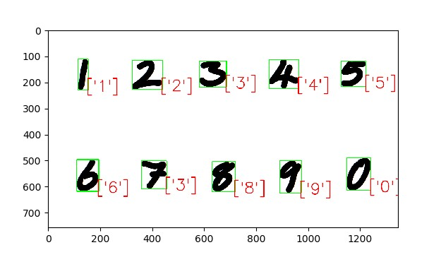

# Handwritten Digit Recognition using PyTorch & MNIST database

handwritten digit recognition using mnist data base for training.

### Prerequisites
1. Handwritten digit recognition project work done on Ubuntu 18.04 with anaconda package installed.
2. Images used for prediction are generated with white background and black font, refer test_fonts.png. In program images converted to inverted colour for further processing.

### Installing

## Install components
1. To install pytorch:

conda install pytorch torchvision -c pytorch

2. To install cv2:

conda install -c conda-forge opencv
conda install -c conda-forge/label/broken opencv 

3. To install matplotlib

conda install -c conda-forge matplotlib
conda install -c conda-forge/label/broken matplotlib
conda install -c conda-forge/label/testing matplotlib
conda install -c conda-forge/label/rc matplotlib   

## OR use below:
To install dependencies in anaconda envirnment, please use below command: 
conda create --name <env> --file requirments.txt

## Running the tests
### 1. How to use train.py (This will generate checkpoint model file)
python train.py --no-cuda (use CPU) --epochs=<Number> --checkpoint=<checkpoint_file_name.pth> 

Example: 
To use GPU:

python train.py  --epochs=10 --checkpoint=./sample_checkpoint_model_epoch10.pth

To use CPU: 

python train.py  --epochs=10 --checkpoint=./sample_checkpoint_model_epoch10.pth --no-cuda
  
### 2. predict.py
python predict.py --input=image=<Input Image Name with path> --checkpoint=<checkpoint_file_name.pth> 

## Input Image File

  
  
Example:
## Output with model file with 1 epochs
python predict_UserImages.py --input-image=./test_fonts.png --checkpoint=./sample_checkpoint_model_epoch1.pth

## Output File

## Output with model file with 10 epochs
in above output 7 is predicted as 3. lets try with higher epochs model file.

python predict_UserImages.py --input-image=./test_fonts.png --checkpoint=./sample_checkpoint_model_epoch10.pth

## Output File

Here 7 is predicted as 7.
