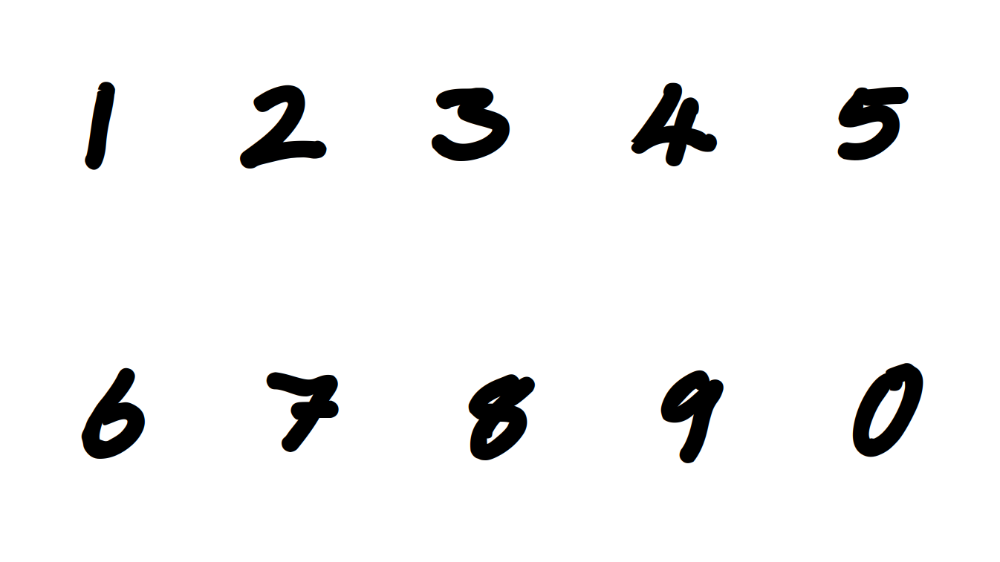
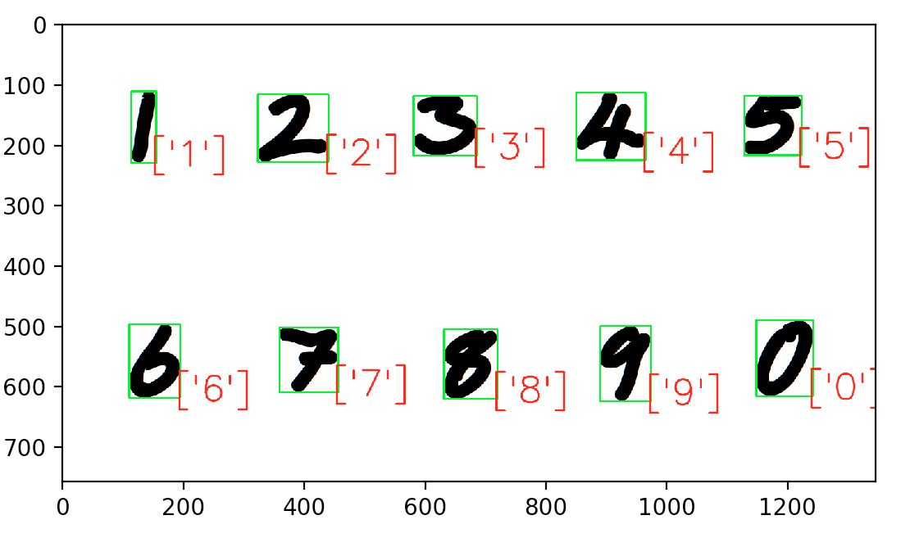

# Handwritten Digit Recognition using MNIST database

handwritten digit recognition using mnist data base for training.

### Prerequisites
Handwritten digit recignition project work done on Ubuntu 18.04 with anaconda package installed.

### Installing
To install dependencies in anaconda envirnment, please use below command: 
conda create --name <env> --file requirments.txt

## Running the tests
### 1. How to use train.py (This will generate checkpoint model file)
python train.py --no-cuda (use CPU) --epochs=<Number> --checkpoint=<checkpoint_file_name.pth> 

Example: 
To use GPU 
python train.py  --epochs=10 --checkpoint=./sample_checkpoint_model_epoch10.pth

To use CPU 
python train.py  --epochs=10 --checkpoint=./sample_checkpoint_model_epoch10.pth --no-cuda
  
### 2. predict.py
python predict.py --input=image=<Input Image Name with path> --checkpoint=<checkpoint_file_name.pth> 
  
Example:
python predict_UserImages.py --input-image=./test_fonts.png --checkpoint=./sample_checkpoint_model_epoch10.pth

### Input Image File

### Output File

